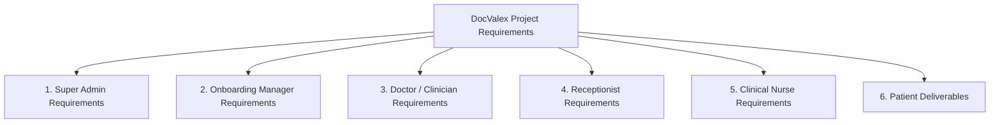
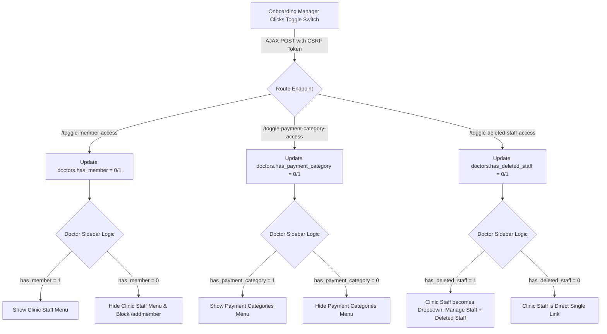
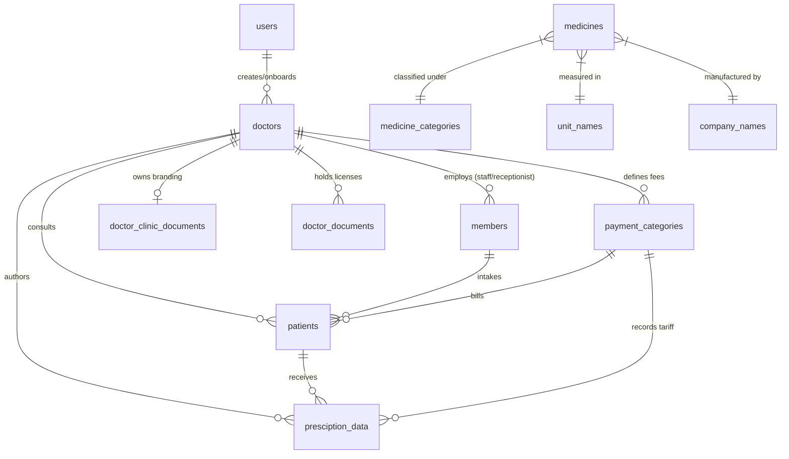
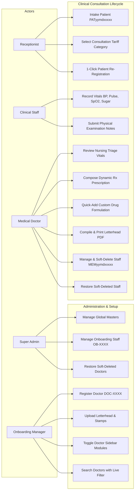
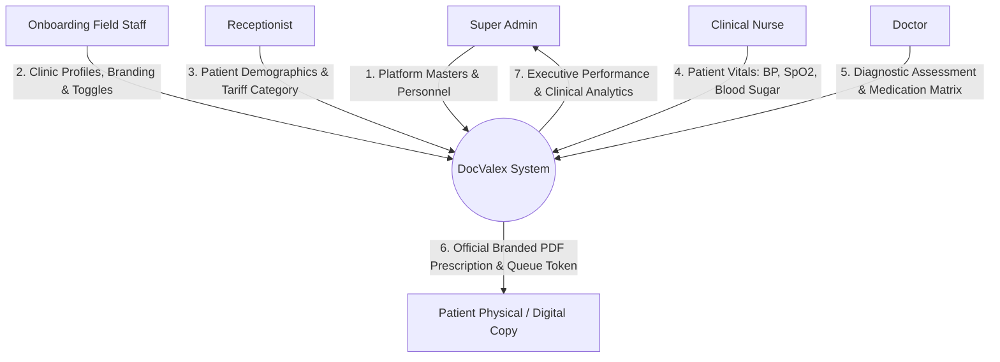
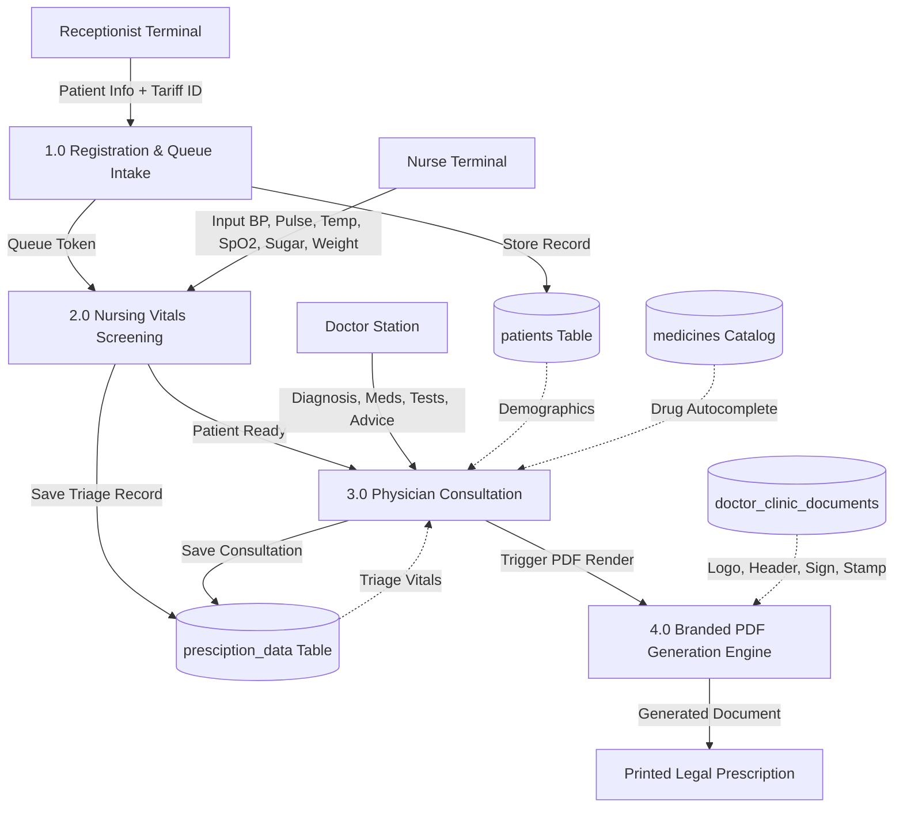
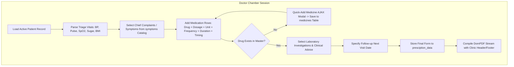
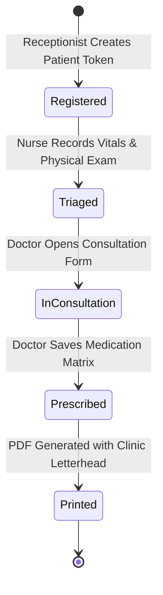

# SOFTWARE REQUIREMENTS SPECIFICATION (SRS)
## FOR DOCVALEX — CLOUD-BASED DOCTOR PRESCRIPTION & CLINIC MANAGEMENT PLATFORM

---

### DOCUMENT CONTROL & METADATA
- **Document Title:** Software Requirements Specification for DocValex Multi-Tenant Clinic Management & Prescription Authoring System
- **Document Identification:** `SRS-DOCVALEX-2026-V1.0`
- **Standard Compliance:** IEEE Std 830-1998 / ISO/IEC/IEEE 29148:2018 Standard
- **Document Version:** 1.0.0 (Comprehensive Enterprise Edition)
- **Status:** Approved for Production Baseline
- **Release Date:** August 14, 2026
- **Prepared By:** Core Software Architecture & Clinical Informatics Engineering Group
- **Organization:** DocValex HealthTech Solutions Pvt. Ltd.

---

## TABLE OF CONTENTS

1. [SECTION 1: INTRODUCTION](#1-introduction)
   - [1.1 Purpose of the Document](#11-purpose-of-the-document)
   - [1.2 Scope of the Product](#12-scope-of-the-product)
   - [1.3 Document Conventions & Standards](#13-document-conventions--standards)
   - [1.4 Intended Audience & Reading Recommendations](#14-intended-audience--reading-recommendations)
   - [1.5 Applicable Standards & References](#15-applicable-standards--references)
   - [1.6 Glossary of Terms, Definitions & Acronyms](#16-glossary-of-terms-definitions--acronyms)
   - [1.7 Business Problem Statement & Core Project Requirements](#17-business-problem-statement--core-project-requirements)
2. [SECTION 2: OVERALL DESCRIPTION](#2-overall-description)
   - [2.1 Product Perspective & Context](#21-product-perspective--context)
   - [2.2 High-Level System Architecture](#22-high-level-system-architecture)
   - [2.3 Product Functions & Subsystem Decomposition](#23-product-functions--subsystem-decomposition)
   - [2.4 User Classes, Personas & Authorization Matrix](#24-user-classes-personas--authorization-matrix)
   - [2.5 Operating Environment & Hardware/Software Stack](#25-operating-environment--hardwaresoftware-stack)
   - [2.6 Design, Technical & Regulatory Constraints](#26-design-technical--regulatory-constraints)
   - [2.7 Assumptions, Dependencies & Risk Factors](#27-assumptions-dependencies--risk-factors)
3. [SECTION 3: SPECIFIC SYSTEM FEATURES & DETAILED FUNCTIONAL REQUIREMENTS](#3-specific-system-features--detailed-functional-requirements)
   - [3.1 Multi-Guard Authentication & Session Segregation Subsystem](#31-multi-guard-authentication--session-segregation-subsystem)
   - [3.2 Super Admin Platform Governance Subsystem](#32-super-admin-platform-governance-subsystem)
   - [3.3 Onboarding Management & Clinic Deployment Subsystem](#33-onboarding-management--clinic-deployment-subsystem)
   - [3.4 Doctor Consultation & Dynamic Rx Authoring Subsystem](#34-doctor-consultation--dynamic-rx-authoring-subsystem)
   - [3.5 Outpatient Registration, Queueing & Tariff Subsystem (Receptionist)](#35-outpatient-registration-queueing--tariff-subsystem-receptionist)
   - [3.6 Pre-Consultation Nursing Triage & Physical Examination Subsystem (Staff)](#36-pre-consultation-nursing-triage--physical-examination-subsystem-staff)
   - [3.7 Pharmacology, Inventory & Global Clinical Masters Subsystem](#37-pharmacology-inventory--global-clinical-masters-subsystem)
   - [3.8 Clinic Branding, Asset Processing & Letterhead PDF Subsystem](#38-clinic-branding-asset-processing--letterhead-pdf-subsystem)
   - [3.9 Asynchronous Permission Toggling Subsystem](#39-asynchronous-permission-toggling-subsystem)
   - [3.10 Enterprise Soft-Delete & Bidirectional Data Recovery Subsystem](#310-enterprise-soft-delete--bidirectional-data-recovery-subsystem)
4. [SECTION 4: EXTERNAL INTERFACE REQUIREMENTS](#4-external-interface-requirements)
   - [4.1 User Interfaces & Visual Design Specifications](#41-user-interfaces--visual-design-specifications)
   - [4.2 Hardware & Printing Interfaces](#42-hardware--printing-interfaces)
   - [4.3 Software & Framework Interfaces](#43-software--framework-interfaces)
   - [4.4 Communications & Network Protocol Interfaces](#44-communications--network-protocol-interfaces)
5. [SECTION 5: NON-FUNCTIONAL REQUIREMENTS & QUALITY ATTRIBUTES](#5-non-functional-requirements--quality-attributes)
   - [5.1 Performance & Response Time Benchmarks](#51-performance--response-time-benchmarks)
   - [5.2 Clinical Safety & Error Prevention Engineering](#52-clinical-safety--error-prevention-engineering)
   - [5.3 Information Security, Cryptography & HIPAA Compliance](#53-information-security-cryptography--hipaa-compliance)
   - [5.4 Reliability, High Availability & Disaster Recovery](#54-reliability-high-availability--disaster-recovery)
   - [5.5 Usability, Learnability & Accessibility Standards](#55-usability-learnability--accessibility-standards)
   - [5.6 Core Business Rules & Algorithmic Logic](#56-core-business-rules--algorithmic-logic)
6. [SECTION 6: DATABASE SCHEMA, ENTITY RELATIONSHIPS & DATA DICTIONARY](#6-database-schema-entity-relationships--data-dictionary)
   - [6.1 Database Architectural Strategy](#61-database-architectural-strategy)
   - [6.2 Detailed Table Dictionaries (All 18 Tables)](#62-detailed-table-dictionaries-all-18-tables)
   - [6.3 Entity-Relationship (ER) Schema Model](#63-entity-relationship-er-schema-model)
7. [SECTION 7: SYSTEM MODELS & ANALYSIS DIAGRAMS](#7-system-models--analysis-diagrams)
   - [7.1 Comprehensive Use Case Diagram](#71-comprehensive-use-case-diagram)
   - [7.2 Data Flow Diagram — Level 0 (Context Level)](#72-data-flow-diagram--level-0-context-level)
   - [7.3 Data Flow Diagram — Level 1 (System Decomposition)](#73-data-flow-diagram--level-1-system-decomposition)
   - [7.4 Data Flow Diagram — Level 2 (Prescription Authoring Pipeline)](#74-data-flow-diagram--level-2-prescription-authoring-pipeline)
   - [7.5 Consultation State Transition Diagram](#75-consultation-state-transition-diagram)
8. [SECTION 8: APPENDICES, VERIFICATION MATRIX & ERROR REGISTRY](#8-appendices-verification-matrix--error-registry)
   - [8.1 Appendix A: Requirements Traceability Matrix (RTM)](#81-appendix-a-requirements-traceability-matrix-rtm)
   - [8.2 Appendix B: Complete Route & Controller Registry](#82-appendix-b-complete-route--controller-registry)
   - [8.3 Appendix C: Diagnostic Error Codes & Exception Handling](#83-appendix-c-diagnostic-error-codes--exception-handling)
   - [8.4 Appendix D: Document Sign-Off & Verification Record](#84-appendix-d-document-sign-off--verification-record)

---

# 1. INTRODUCTION

## 1.1 Purpose of the Document
This Software Requirements Specification (SRS) provides an exhaustive, formal, and authoritative technical definition of the **DocValex Cloud-Based Doctor Prescription & Clinic Management Platform**. It details every functional capability, algorithmic workflow, database model, external interface, security protocol, and quality attribute. 

This document acts as the definitive contract between healthcare stakeholders, software architects, implementation engineers, quality assurance teams, and regulatory auditors.

## 1.2 Scope of the Product
**DocValex** is an enterprise-grade, multi-tenant clinical software solution engineered to digitize outpatient clinical workflows from patient reception to prescription dispatch. 

### Key Capabilities:
1. **Multi-Tier Role Isolation:** Independent security contexts for Super Administrators, Onboarding Field Managers, Medical Doctors, Clinic Receptionists, and Nursing Staff.
2. **High-Speed Outpatient (OPD) Flow:** Rapid patient intake, token generation, tariff-based consultation categorizations, and one-click historical re-registrations.
3. **Nursing Vitals Screening:** Pre-consultation vitals triaging capturing Blood Pressure, Pulse Rate, Temperature, Respiratory Rate, Oxygen Saturation ($\text{SpO}_2$), Blood Sugar, Weight, Height, and Body Mass Index (BMI).
4. **Interactive Digital Prescription Authoring:** Multi-row dynamic prescription composition with generic/brand drug search, standardized dosages, intervals, durations, clinical advice, symptoms, and lab tests.
5. **Custom Letterhead PDF Engine:** Instant compilation and rendering of high-resolution digital prescriptions incorporating clinic branding, digital signatures, stamps, and layout styles.
6. **Master Pharmacology & Clinical Directory:** Normalized database catalogs for medications, dose units, diagnostic tests, medical symptoms, and manufacturers.
7. **Granular Access Control & Recovery:** Real-time feature visibility toggling in Doctor sidebars and bidirectional soft-deletion protection across all clinical entities.

## 1.3 Document Conventions & Standards
- **Requirement Formatting:** Every requirement is uniquely identified using `FR-[CATEGORY]-[ID]` for Functional Requirements and `NFR-[CATEGORY]-[ID]` for Non-Functional Requirements.
- **Priority Designations:**
  - **[CRITICAL / MANDATORY]:** Core capability required for platform deployment.
  - **[HIGH]:** Essential operational requirement.
  - **[MEDIUM]:** Secondary optimization or workflow enhancement.
- **Normative Verbal Forms:** The keywords *SHALL* and *MUST* indicate mandatory technical requirements; *SHOULD* indicates strong architectural recommendations; *MAY* indicates permissible design options.

## 1.4 Intended Audience & Reading Recommendations
- **System Architects & Lead Developers:** Read Sections 2, 3, 5, 6, and 7 to understand data flow, state transitions, security boundaries, and schema structures.
- **QA Engineers & Test Automation Teams:** Reference Section 3, Section 5, and Appendix 8.1 (Traceability Matrix) to design unit, integration, and end-to-end regression suites.
- **Hospital Administrators & Clinical Leads:** Review Section 2.3, Section 3.4, 3.5, 3.6, and Section 5.2 for compliance with clinical governance and workflow alignment.

## 1.5 Applicable Standards & References
1. **IEEE Std 830-1998:** Recommended Practice for Software Requirements Specifications.
2. **ISO/IEC/IEEE 29148:2018:** Systems and software engineering — Life cycle processes — Requirements engineering.
3. **Laravel 11.x Framework Architecture Guide:** PSR-4 autoloading, Eloquent ORM, Multi-Guard Authentication, CSRF/XSS Middleware.
4. **W3C Web Content Accessibility Guidelines (WCAG 2.1 AA):** Visual contrast, touch target dimensions, and semantic UI structure.
5. **National Digital Health Mission (NDHM / ABDM) Guidelines:** Electronic Medical Records (EMR) and digital prescription standards.

## 1.6 Glossary of Terms, Definitions & Acronyms

| Term / Acronym | Definition & Clinical Context |
| :--- | :--- |
| **Bcrypt** | Key derivation hashing algorithm incorporating cryptographic salting and an adaptive work factor. |
| **Chief Complaint** | The primary symptom or reason stated by the patient for seeking medical care. |
| **CSRF** | Cross-Site Request Forgery; an attack forcing an authenticated user to execute unauthorized actions. |
| **DomPDF** | HTML to PDF rendering engine converting styled Blade templates into standard A4 printable documents. |
| **EMR / EHR** | Electronic Medical Record / Electronic Health Record. |
| **Eloquent ORM** | Laravel's ActiveRecord implementation for relational database mapping and prepared query execution. |
| **Multi-Guard** | Authentication subsystem configuring segregated session tokens across `users`, `doctors`, and `members` tables. |
| **OPD** | Outpatient Department; clinical consultations conducted without overnight hospital admission. |
| **Rx** | Prescription symbol derived from the Latin *recipe* ("to take"). |
| **Soft Delete** | Database pattern flagging records with `isdeleted = 1` rather than executing physical `DELETE` queries. |
| **SpO2** | Saturation of Peripheral Capillary Oxygen measured via pulse oximetry percentage. |
| **Triage** | Preliminary clinical screening by nursing staff to measure physiological vitals prior to physician consultation. |

## 1.7 Business Problem Statement & Core Project Requirements

### 1.7.1 Background & Clinical Problem Statement
Traditional outpatient clinics and private medical practices in India and globally face severe operational, clinical, and patient safety challenges due to paper-based systems, illegible handwriting, and fragmented standalone software:

| # | Clinical / Operational Challenge | Real-World Clinical Risk | DocValex Solution |
| :---: | :--- | :--- | :--- |
| **1** | **Illegible Handwritten Prescriptions** | Pharmacy dispensing errors, wrong dosages, adverse drug-drug interactions, patient confusion. | **Dynamic Digital Prescription Writer** with autocomplete drug database and standardized dosages/frequencies. |
| **2** | **Disconnected Nursing Vitals & Triage Bottlenecks** | Vitals recorded on paper slips get misplaced, lost, or delayed before physician consultation. | **Integrated Nursing Triage Portal** auto-syncing BP, Pulse, Temp, $\text{SpO}_2$, Blood Sugar, and BMI directly to doctor. |
| **3** | **Loss of Historical Medical Records** | Repeat patients forget paper slips; doctors lack past treatment history during re-consultations. | **Centralized Patient EHR Record & 1-Click Re-registration** preserving complete consultation histories. |
| **4** | **Lack of Professional Clinic Branding** | Clinics cannot generate standardized, legally compliant letterhead prescriptions with verified signatures/stamps. | **Custom Letterhead PDF Engine** dynamically composing clinic headers, footers, signatures, and stamps. |
| **5** | **No Role Segregation / Security Vulnerabilities** | Receptionists, nurses, and doctors share accounts or access unauthorized clinical sections. | **Multi-Guard Security Subsystem** isolating `web` (Admin/Onboarding), `doctor`, and `member` (Receptionist/Nurse). |
| **6** | **Catastrophic Accidental Data Loss** | Accidental deletion of a doctor or staff member permanently purges medical records without recovery. | **Enterprise Universal Soft-Delete & 1-Click Restoration** across all doctors, staff, and onboarding managers. |
| **7** | **Rigid, Inflexible Doctor Dashboards** | Clinics forced into rigid software configurations regardless of staff size or billing models. | **Granular Feature Access Toggles** allowing Onboarding managers to customize sidebar features per doctor. |

---

### 1.7.2 Core Project Objectives & Key Results (OKRs)
The **DocValex Platform** was designed and engineered to fulfill six primary clinical objectives:
- **Objective 1 (100% Prescription Legibility & Accuracy):** Eliminate 100% of handwriting-related dispensing errors by providing normalized medication catalogs with automatic interval and duration calculations.
- **Objective 2 (Unified Outpatient Workflow Pipeline):** Connect Front-Desk Patient Registration $\rightarrow$ Pre-Consultation Nursing Vitals Screening $\rightarrow$ Doctor Consultation & Rx Authoring $\rightarrow$ Branded A4 PDF Print into an uninterrupted clinical flow.
- **Objective 3 (Role-Based Multi-Tenancy):** Implement three segregated authentication guards (`web`, `doctor`, `member`) preventing privilege elevation and session cross-contamination.
- **Objective 4 (Branded Legal Letterhead Generation):** Generate high-definition, printable A4 PDF prescriptions compliant with medical regulatory standards within $1.0\text{ second}$.
- **Objective 5 (Field Onboarding Governance):** Empower field onboarding personnel to enroll doctors (`DOC-XXXX`), manage branding assets, and configure doctor sidebar modules via real-time AJAX toggles.
- **Objective 6 (Fail-Safe Data Preservation):** Implement universal soft-delete protection ensuring that any deleted doctor, staff member, or clinical record can be restored instantly with zero data loss.

---

### 1.7.3 Comprehensive Stakeholder & User Requirements by Role



#### 1. Super Admin Requirements (UR-ADM)
- **UR-ADM-01 [Executive Analytics]:** Must display real-time KPI metrics tracking active doctors, soft-deleted doctors, onboarding field staff, and consultation volumes.
- **UR-ADM-02 [Onboarding Personnel Lifecycle]:** Must provide complete CRUD operations for Onboarding Field Managers with auto-generated sequential IDs (`OB-0001`, `OB-0002`, etc.).
- **UR-ADM-03 [Global Pharmacology & Clinical Masters]:** Must maintain normalized global catalogs for:
  - Drug Categories (`medicine_categories`)
  - Standard Dosages (`dosage_names`)
  - Dosage Intervals / Frequencies (`interval_names`)
  - Course Durations (`duration_names`)
  - Measurement Units (`unit_names`)
  - Pharmaceutical Manufacturers (`company_names`)
  - Chief Medical Complaints / Symptoms (`symptoms`)
  - Diagnostic Laboratory & Imaging Tests (`diagnosis_tests`)
  - Standard Lifestyle & Dietary Advice (`suggestions`)
- **UR-ADM-04 [Data Recovery & Restoration]:** Must provide a dedicated recovery module at `/deleteddoctor` and `/deletedonboarding` to restore soft-deleted doctors and onboarding staff with single-click actions.
- **UR-ADM-05 [Platform Password & Security Management]:** Must allow Super Admin to securely reset doctor and administrative credentials.

#### 2. Onboarding Manager Requirements (UR-ONB)
- **UR-ONB-01 [Doctor Enrollment]:** Must allow field registration of medical practitioners with auto-generated sequential IDs (`DOC-0001`, `DOC-0002`, etc.) and creator attribution.
- **UR-ONB-02 [Clinic Branding Asset Uploads]:** Must allow uploading and managing clinic branding graphics:
  - Doctor Profile Photo (`photo`)
  - Doctor Digital Signature (`doctor_sign`)
  - Clinic Official Stamp (`clinic_stamp`)
  - Custom Prescription Header Banner (`header`)
  - Custom Prescription Footer Banner (`footer`)
- **UR-ONB-03 [Tabular Asset Table & Full-Screen Modal]:** Must present all uploaded clinic documents in a clean tabular view with an integrated full-screen Image/PDF Preview Modal and external tab launcher.
- **UR-ONB-04 [Multi-Column Live Search & Pagination]:** Must provide real-time search filtering across Doctor Name, Employee ID, Email, Phone, Specialization, Clinic Name, and Creator with Bootstrap 5 pagination.
- **UR-ONB-05 [Creator Attribution & Super Admin Visibility]:** Onboarding managers must be able to view doctors created by Super Admin as well as their own registered clinics with distinctive role badges.
- **UR-ONB-06 [Granular Feature Visibility Toggles]:** Must provide real-time AJAX toggle switches on the Manage Doctors table to configure:
  1. **Staff Module Toggle (`has_member`):** Shows/Hides Clinic Staff menu in doctor sidebar.
  2. **Payment Category Toggle (`has_payment_category`):** Shows/Hides Payment Categories menu in doctor sidebar.
  3. **Deleted Staff Toggle (`has_deleted_staff`):** Shows/Hides Deleted Staff submenu in doctor sidebar.

#### 3. Doctor / Medical Practitioner Requirements (UR-DOC)
- **UR-DOC-01 [Real-Time Triage Vitals Sync]:** Consultation interface (`/patient.writeprescription/{id}`) must automatically load nursing triage vitals (Blood Pressure, Pulse, Temp, $\text{SpO}_2$, Blood Sugar, Weight, Height, BMI).
- **UR-DOC-02 [Dynamic Multi-Row Medication Matrix]:** Must provide an interactive medication matrix allowing doctors to prescribe multiple drugs with:
  - Medicine Brand / Generic Name
  - Dosage Type & Quantity (e.g., `1 Tab`, `5 ml`, `2 Drops`)
  - Measurement Unit (e.g., `mg`, `ml`, `mcg`, `IU`)
  - Administration Frequency (e.g., `1-0-0`, `1-0-1`, `1-1-1`, `SOS`)
  - Course Duration (e.g., `3 Days`, `5 Days`, `1 Month`)
  - Food Timing (e.g., `Before Food`, `After Food`, `With Food`)
  - Special Instructions
- **UR-DOC-03 [Quick-Add Medicine On-The-Fly]:** Must allow adding new pharmaceutical brands into the master database via a popup modal without closing or losing active prescription input.
- **UR-DOC-04 [Comprehensive Clinical Documentation]:** Must capture:
  - Chief Symptoms / Complaints (multi-select autocomplete)
  - Provisional and Definitive Clinical Diagnosis
  - Diagnostic Laboratory / Radiology Tests (multi-select autocomplete)
  - Lifestyle and Dietary Advice (multi-select standard advice)
  - Scheduled Next Follow-up Appointment Date
- **UR-DOC-05 [High-Resolution Printable Letterhead PDF]:** Must instantly compile and generate downloadable/printable A4 PDF prescriptions featuring clinic headers, footers, digital signatures, and stamps.
- **UR-DOC-06 [Clinic Staff Governance & Submenus]:** Doctor must be able to create, update, softly delete, and restore receptionists and nurses. When enabled, sidebar must display **Clinic Staff** with subcategories:
  - ↳ **Manage Staff** (`/addmember`)
  - ↳ **Deleted Staff** (`/doctor/deleted-staff`)
- **UR-DOC-07 [Custom Consultation Tariff Pricing]:** Doctor must be able to define custom prices for clinic payment categories (e.g., General OPD: ₹300, Emergency: ₹700, VIP: ₹1000).

#### 4. Front-Desk Receptionist Requirements (UR-REC)
- **UR-REC-01 [Rapid Outpatient Intake]:** Must register incoming patients with Full Name, Guardian Type, Guardian Name, Age, Gender, Mobile, Aadhar, and Address, generating unique tokens (`PATyymdxxxxx` and `yymdxxxxx`).
- **UR-REC-02 [Doctor & Tariff Billing Assignment]:** Must assign registered patients to a specific Doctor and select an applicable consultation fee / payment category.
- **UR-REC-03 [1-Click Historical Re-Registration]:** Must search past patient records by Mobile Number or Name and initiate instant **1-Click Re-Registration** for today's OPD session without retyping data.
- **UR-REC-04 [Live Daily Outpatient Queue]:** Must display today's live OPD queue tracking patient movement (*Registered* $\rightarrow$ *Triaged* $\rightarrow$ *In Consultation* $\rightarrow$ *Completed*).

#### 5. Clinical Staff / Triage Nurse Requirements (UR-STF)
- **UR-STF-01 [Triage Queue Monitoring]:** Must display the live queue of registered patients awaiting pre-consultation screening.
- **UR-STF-02 [Standardized Vitals Screening]:** Must record physiological vitals:
  - Blood Pressure (Systolic/Diastolic in $\text{mmHg}$)
  - Pulse Rate in $\text{beats per minute (bpm)}$
  - Body Temperature in $^\circ\text{F}$
  - Oxygen Saturation ($\text{SpO}_2\%$)
  - Blood Glucose / Sugar Level in $\text{mg/dL}$
  - Body Weight in $\text{kg}$ and Height in $\text{cm}$ (with auto BMI calculation)
- **UR-STF-03 [Physical Examination Documentation]:** Must record clinical nursing observations (Pallor, Icterus, Cyanosis, Clubbing, Edema, Lymphadenopathy).
- **UR-STF-04 [Instant Physician Chamber Sync]:** Submitted vitals must immediately populate the Doctor's consultation chamber screen.

#### 6. Patient Deliverables (UR-PAT)
- **UR-PAT-01 [Clear, Legible Digital Prescription]:** Patient receives a 100% typed, crystal-clear printed prescription with explicit medication timings and dosages.
- **UR-PAT-02 [Verified Legal Document]:** Prescription contains registered clinic address, doctor council registration number, digital signature, and official clinic stamp.
- **UR-PAT-03 [Follow-Up Scheduling]:** Clear indication of the next scheduled follow-up consultation date.

---

### 1.7.4 Project Feature-to-Requirement Traceability Matrix

| Feature Domain | Requirement IDs Covered | Target Subsystem & Primary Route | Primary User Role |
| :--- | :--- | :--- | :--- |
| **Authentication & Security** | `UR-ADM-05`, `NFR-SEC-01..03` | `AuthenticatedSessionController` (`/login`) | All Platform Users |
| **Executive Governance** | `UR-ADM-01..04`, `FR-ADM-201..203`| `AdminController` (`/Admindashboard`) | Super Admin |
| **Field Clinic Onboarding** | `UR-ONB-01..05`, `FR-ONB-301..303`| `DoctorsController` (`/manage.doctor`) | Onboarding Manager |
| **Permission Toggling** | `UR-ONB-06`, `FR-ONB-304` | `DoctorsController` (`/doctor/{id}/toggle-*`) | Onboarding Manager |
| **Doctor Rx Authoring** | `UR-DOC-01..05`, `FR-DOC-401..405`| `patientController` (`/patient.writeprescription`) | Medical Doctor |
| **Quick-Add Medicine** | `UR-DOC-03`, `FR-DOC-403` | `patientController@quickAddMedicine` | Medical Doctor |
| **Letterhead PDF Engine** | `UR-DOC-05`, `UR-PAT-01..02` | `PrescriptionController@downloadpdf` | Medical Doctor |
| **Staff Governance & Submenu** | `UR-DOC-06`, `FR-DOC-406` | `AddmemberController` (`/addmember`, `/doctor/deleted-staff`) | Medical Doctor |
| **OPD Intake & Billing** | `UR-REC-01..04`, `FR-REC-501..503`| `ReceptionistController` (`/receptionist/patients`) | Receptionist |
| **Nursing Vitals Triage** | `UR-STF-01..04`, `FR-STF-601..603`| `StaffController` (`/staff/physical-exam/{id}`) | Clinical Staff / Nurse |
| **Pharmacology Masters** | `UR-ADM-03`, `FR-MST-01..02` | `MedicinemasterController` (`/medicinemaster`) | Super Admin |
| **Soft-Delete & Recovery** | `UR-ADM-04`, `UR-DOC-06`, `FR-DEL-01..03` | `DoctorController`, `AddmemberController` | Super Admin / Doctor |

---

# 2. OVERALL DESCRIPTION

## 2.1 Product Perspective & Context
DocValex functions as a cloud-native, centralized healthcare ecosystem. It operates in an asynchronous client-server topology using PHP 8.2+ and Laravel 11.x MVC on the backend, interacting with modern web browser endpoints across varied clinic terminals.

```
+---------------------------------------------------------------------------------------+
|                                    CLIENT TIER                                        |
|  [Super Admin Station]  [Onboarding Tablet]  [Doctor Chamber PC]  [Reception/Nurse Tab] |
+---------------------------------------------------------------------------------------+
                                           │
                                           │ HTTPS (TLS 1.3) / JSON AJAX / Multi-part Form
                                           ▼
+---------------------------------------------------------------------------------------+
|                                    GATEWAY & ROUTING                                  |
|   - Web Server (Nginx/Apache) -> PHP-FPM 8.2+ -> Laravel 11 HTTP Routing Middleware   |
|   - Multi-Guard Security Kernel (web, auth:doctor, auth:member)                       |
+---------------------------------------------------------------------------------------+
                                           │
            ┌──────────────────────────────┼──────────────────────────────┐
            ▼                              ▼                              ▼
+-----------------------+      +-----------------------+      +-----------------------+
|   ADMIN / ONBOARDING  |      |   DOCTOR SUB-SYSTEM   |      |    CLINIC STAFF OPS   |
|   - AdminController   |      |   - patientController |      |   - ReceptionistCtrl  |
|   - DoctorsController |      |   - PrescriptionCtrl  |      |   - StaffController   |
|   - onboardingCtrl    |      |   - AddmemberCtrl     |      |   - AddmemberCtrl     |
+-----------------------+      +-----------------------+      +-----------------------+
            │                              │                              │
            └──────────────────────────────┼──────────────────────────────┘
                                           │
                                           ▼
+---------------------------------------------------------------------------------------+
|                                 PERSISTENCE TIER                                      |
|                       MySQL 8.0 Relational Database Engine                            |
|    - Schema Tables: users, doctors, members, patients, presciption_datas, medicines   |
|    - Storage Filesystem: doctor_assets/ (logos, stamps, signatures, headers, footers) |
+---------------------------------------------------------------------------------------+
```

## 2.2 High-Level System Architecture
The application separates concerns across 4 discrete tiers:
1. **Presentation Tier (Blade Templates & Responsive CSS):** Renders server-side HTML5 views with embedded responsive styling, Bootstrap 5 UI widgets, and AJAX handlers.
2. **Controller & Middleware Tier:** Enforces authentication guards, validates incoming request payloads, processes business logic, and manages session state.
3. **Model & Business Logic Tier:** Encapsulates Eloquent data relationships, dynamic accessors, mutators, query scopes, and calculations.
4. **Data & File Store Tier:** Houses normalized relational data in MySQL and branding image assets in local/cloud storage.

## 2.3 Product Functions & Subsystem Decomposition

```mermaid
graph TD
    DOCVALEX[DocValex Platform Core]
    
    DOCVALEX --> S1[1. Authentication & Security]
    DOCVALEX --> S2[2. Super Admin Governance]
    DOCVALEX --> S3[3. Onboarding & Clinic Setup]
    DOCVALEX --> S4[4. Doctor Consultation & Rx]
    DOCVALEX --> S5[5. Reception Queue & Billing]
    DOCVALEX --> S6[6. Nursing Vitals Triage]
    DOCVALEX --> S7[7. Pharmacology Masters]
    DOCVALEX --> S8[8. Branding & PDF Engine]
    DOCVALEX --> S9[9. Soft-Delete & Data Recovery]

    S1 --> S1_1[Multi-Guard Login]
    S1 --> S1_2[Bcrypt Hashing]
    S1 --> S1_3[Session Timeout]

    S3 --> S3_1[Doctor Registration DOC-XXXX]
    S3 --> S3_2[Asset Uploads]
    S3 --> S3_3[Sidebar Permission Toggles]

    S4 --> S4_1[Dynamic Rx Authoring]
    S4 --> S4_2[Quick-Add Medicine]
    S4 --> S4_3[Staff Management]

    S5 --> S5_1[Patient Intake PATyymdxxxxx]
    S5 --> S5_2[Tariff Categorization]
    S5 --> S5_3[1-Click Re-Registration]

    S6 --> S6_1[Vitals: BP/Pulse/SpO2/Sugar]
    S6 --> S6_2[Physical Examination]
```



## 2.4 User Classes, Personas & Authorization Matrix

| Operational Capability / Route Action | Super Admin (`web:admin`) | Onboarding Mgr (`web:onboarding`) | Doctor (`doctor`) | Receptionist (`member:receptionist`) | Clinical Staff (`member:staff`) |
| :--- | :---: | :---: | :---: | :---: | :---: |
| **Platform Analytics & Health Dashboard** | **Full** | Restricted | No Access | No Access | No Access |
| **Manage Onboarding Personnel (`OB-XXXX`)**| **Full** | No Access | No Access | No Access | No Access |
| **Global Clinical Master Catalogs** | **Full** | Read-Only | Read-Only | No Access | No Access |
| **Register New Doctor Profile (`DOC-XXXX`)**| **Full** | **Full** | No Access | No Access | No Access |
| **Upload Clinic Branding Assets & Headers** | **Full** | **Full** | Own Profile | No Access | No Access |
| **Toggle Doctor Sidebar Permissions** | No Access | **Full** | No Access | No Access | No Access |
| **Register OPD Patient (`PATyymdxxxxx`)** | Read-Only | Read-Only | **Full** | **Full** | No Access |
| **Record Patient Triage Vitals & Vitals Exam**| Read-Only | Read-Only | **Full** | No Access | **Full** |
| **Author & Sign Digital Prescription** | No Access | No Access | **Full** | No Access | No Access |
| **Generate & Download Branded PDF Rx** | Read-Only | Read-Only | **Full** | No Access | No Access |
| **Quick-Add Custom Medicine to Master** | **Full** | No Access | **Full** | No Access | No Access |
| **Manage Clinic Staff (`MEMyymdxxxxx`)** | No Access | View Summary | **Full** | No Access | No Access |
| **Soft-Delete & Restore Clinic Staff** | No Access | No Access | **Full** | No Access | No Access |
| **Soft-Delete & Restore Doctors** | **Full** | No Access | No Access | No Access | No Access |

## 2.5 Operating Environment & Hardware/Software Stack
- **Database Engine:** MySQL 8.0.32+ utilizing InnoDB engine, UTF8MB4 collation, and foreign key enforcement.
- **Backend Language & Framework:** PHP 8.2.18 / Laravel 11.9.0.
- **Frontend Stack:** HTML5, Vanilla JavaScript (ES6+), CSS3 (Custom Valex Healthcare Design System), Bootstrap 5.3.3.
- **Asset Bundler:** Vite 5.x.
- **Cryptographic Subsystem:** OpenSSL 3.0+ utilizing SHA-256 for CSRF and Bcrypt for credential hashing.

## 2.6 Design, Technical & Regulatory Constraints
1. **Multi-Tenancy Guard Isolation:** Authentication across administrative users (`users`), physicians (`doctors`), and operational staff (`members`) must be maintained in isolated state guards to avoid privilege elevation.
2. **Statutory Medical Prescription Layout:** Printable prescriptions must clearly display doctor registration numbers, qualifications, clinic address, patient details, date of consultation, and explicit medication instructions.
3. **Data Loss Prevention:** Physical deletion of clinical records (doctors, patients, prescriptions, staff) is forbidden at the client layer; all deletions must be executed via soft-deletion flags.

## 2.7 Assumptions, Dependencies & Risk Factors
- **Network Continuity:** Clinics maintain stable broadband ($>2\text{ Mbps}$) connectivity.
- **Data Backup Dependency:** Database backups are scheduled daily via automated cron utilities.
- **Risk Mitigation:** If external CSS CDN assets fail, the system must retain functional fallback styles from local asset distributions.

---

# 3. SPECIFIC SYSTEM FEATURES & DETAILED FUNCTIONAL REQUIREMENTS

## 3.1 Multi-Guard Authentication & Session Segregation Subsystem

### 3.1.1 Purpose & Scope
Provides secure, single-entry authentication for all platform users while routing them to distinct security guards and session contexts based on database credentials.

### 3.1.2 Functional Specifications & Logic
- **FR-AUTH-101 [MANDATORY]:** The system SHALL render a unified login interface at `/` accepting `email` and `password`.
- **FR-AUTH-102 [MANDATORY]:** The authentication pipeline SHALL evaluate credentials in sequential order:
  1. Check `users` table where `email = :email`. If password matches via `Hash::check()`:
     - If `isdeleted == 1` or `status == 'inactive'`, abort login with error `"Your account has been deactivated/deleted."`
     - Else, establish session under `web` guard. Redirect `role == 'admin'` to `/Admindashboard` and `role == 'onboarding'` to `/onboarding/dashboard`.
  2. Check `doctors` table where `email = :email`. If password matches:
     - If `isdeleted == 1` or `status == 0`, abort login with error `"Your doctor account has been deactivated. Please contact support."`
     - Else, establish session under `auth:doctor` guard and redirect to `/doctor/dashboard`.
  3. Check `members` table where `email = :email`. If password matches:
     - If `isdeleted == 1`, abort with error `"Your account has been deleted. Please contact your doctor."`
     - If `status != 'active'`, abort with error `"Your account is inactive. Please contact the administrator."`
     - Else, establish session under `auth:member` guard. Redirect `role == 'receptionist'` to `/receptionist/dashboard` and `role == 'staff'` to `/staff/dashboard`.
  4. If no records match, return HTTP 422 with `"Invalid Email or Password"`.
- **FR-AUTH-103 [MANDATORY]:** The system SHALL provide secure logout endpoints invalidating session tokens and redirecting to `/`.

---

## 3.2 Super Admin Platform Governance Subsystem

### 3.2.1 Purpose & Scope
Enables executive platform management, global KPIs, onboarding staff governance, and global pharmacology master management.

### 3.2.2 Functional Specifications & Logic
- **FR-ADM-201 [HIGH]:** The Super Admin Dashboard (`/Admindashboard`) SHALL calculate and display:
  - Total Active Doctors (`Doctor::where('isdeleted', 0)->count()`)
  - Total Deleted Doctors (`Doctor::where('isdeleted', 1)->count()`)
  - Total Onboarding Managers (`User::where('role', 'onboarding')->where('isdeleted', 0)->count()`)
  - Total Active Medicines in Catalog (`Medicine::where('isdeleted', 0)->count()`)
- **FR-ADM-202 [MANDATORY]:** The Super Admin SHALL manage Onboarding Managers at `/onboarding`:
  - **Create Onboarding Manager:** Input Name, Email, Phone, Password. Auto-generate `member_id` with format `OB-XXXX` (e.g., `OB-0001`, `OB-0002`).
  - **Deactivate Manager:** Toggle active status between `active` and `inactive`.
  - **Soft-Delete Manager:** Set `isdeleted = 1`.
  - **Restore Manager:** Restore account from `/deletedonboarding` by resetting `isdeleted = 0`.
- **FR-ADM-203 [MANDATORY]:** The Super Admin SHALL maintain Master Catalogs:
  - Drug Categories (`/category`)
  - Standard Dosages (`/dosage`)
  - Dosage Intervals / Frequencies (`/interval`)
  - Treatment Durations (`/duration`)
  - Formulation Measurement Units (`/unit`)
  - Pharmaceutical Manufacturers (`/company`)
  - Medical Chief Complaints / Symptoms (`/admin.symptoms`)
  - Diagnostic Laboratory / Imaging Tests (`/diagnosistest`)
  - Standard Clinical Advice / Suggestions (`/suggestion`)

---

## 3.3 Onboarding Management & Clinic Deployment Subsystem

### 3.3.1 Purpose & Scope
Provides field deployment capabilities for Onboarding Managers to register clinics, configure letterheads, upload digital signatures/stamps, and customize doctor sidebar access.

### 3.3.2 Functional Specifications & Logic
- **FR-ONB-301 [MANDATORY]:** The Onboarding Manager SHALL register doctors at `/adddoctor.onboarding`:
  - Input: Doctor Name, Email, Password (8-16 chars), Clinic Name, Phone, Specialization.
  - **Doctor ID Generator Algorithm:** The system SHALL query the latest `Doctor_Emp_id`, parse the numerical suffix, increment by 1, and zero-pad to 4 digits prefixed with `DOC-` (e.g., `DOC-0001` $\rightarrow$ `DOC-0002` $\rightarrow$ `DOC-0100`).
  - Set `created_by` and `updated_by` to the logged-in onboarding member's ID or name.
- **FR-ONB-302 [MANDATORY]:** Manage Doctors Screen (`/manage.doctor`):
  - **Live Search Filtering:** Real-time multi-column search query evaluating:
    $$\text{Search Match} \iff \text{name} \lor \text{Doctor\_Emp\_id} \lor \text{email} \lor \text{phone} \lor \text{clinic\_name} \lor \text{specialization} \lor \text{created\_by}$$
  - **Bootstrap 5 Pagination:** Displays 10 records per page with search query string preservation (`withQueryString()`).
  - **Creator Isolation Rule:** The view SHALL display all doctors created by Super Admin (`created_by IN ('Super Admin', 'Admin', ...)` or `NULL`) plus doctors created by the currently authenticated Onboarding Manager.
  - **Creator Badge:** Each doctor row displays a distinctive badge (`Super Admin` in purple or `Onboarding Creator Name` in blue).
- **FR-ONB-303 [HIGH]:** View Doctor Screen (`/onboarding.view.doctor/{id}`):
  - Displays Doctor Profile Info, Specialization, Experience, Total Patient Consultations, and Registered Clinic Team table.
  - **Doctor Documents & Assets Table:** Displays all uploaded branding assets in tabular format:
    - Columns: `#`, `Document Title & Filename`, `Category / Type`, `Doc / Reg. Number`, `Status`, `Action`.
    - **Large Preview Modal:** Clicking *View File* opens a fullscreen modal rendering image previews (`.jpg`, `.png`, `.webp`) or native iframe PDF viewers with a 1-click *Open in New Tab* button.
- **FR-ONB-304 [MANDATORY]:** Asynchronous Feature Access Toggles:
  - **Staff Module Toggle (`has_member`):** Sends AJAX `POST` to `/doctor/{id}/toggle-member-access`. Toggles between `1` (Visible) and `0` (Hidden).
  - **Payment Category Toggle (`has_payment_category`):** Sends AJAX `POST` to `/doctor/{id}/toggle-payment-category-access`. Toggles between `1` (Visible) and `0` (Hidden).
  - **Deleted Staff Toggle (`has_deleted_staff`):** Sends AJAX `POST` to `/doctor/{id}/toggle-deleted-staff-access`. Toggles between `1` (Visible) and `0` (Hidden).
  - On toggle change, return JSON: `{"success": true, "status": boolean, "message": "string"}`.

---

## 3.4 Doctor Consultation & Dynamic Rx Authoring Subsystem

### 3.4.1 Purpose & Scope
The core clinical portal where doctors conduct outpatient consultations, analyze nursing triage data, author digital prescriptions, quick-add medicines, and print official letterheads.

### 3.4.2 Functional Specifications & Logic
- **FR-DOC-401 [MANDATORY]:** Doctor Consultation Interface (`/patient.writeprescription/{id}`):
  - Automatically loads patient demographics and pre-recorded nursing vitals:
    - Blood Pressure (`blood_pressure`)
    - Pulse Rate (`pulse_rate` in bpm)
    - Body Temperature (`temperature` in $^\circ\text{F}$)
    - Oxygen Saturation (`spo2` in $\%$)
    - Random/Fasting Blood Sugar (`sugar` in $\text{mg/dL}$)
    - Weight in $\text{kg}$, Height in $\text{cm}$.
- **FR-DOC-402 [MANDATORY]:** Dynamic Medication Matrix:
  - Doctors add one or multiple drug rows. Each row captures:
    - `medicine_id`: Foreign key or name from `medicines` catalog.
    - `dosage`: Selected dosage form (e.g., `1 Tablet`, `5 ml`, `1 Capsule`).
    - `unit`: Measurement unit (e.g., `mg`, `ml`, `mcg`).
    - `frequency`: Dosage interval (e.g., `Once Daily (OD)`, `Twice Daily (BD)`, `Thrice Daily (TDS)`).
    - `duration`: Treatment timeframe (e.g., `3 Days`, `5 Days`, `1 Month`).
    - `timing`: Food relation (e.g., `Before Food`, `After Food`, `With Food`).
- **FR-DOC-403 [HIGH]:** Quick-Add Medicine Modal:
  - Allows the doctor to register a new drug brand into `medicines` on-the-fly via AJAX endpoint `/doctor/medicine/quick-add`. Returns JSON with the newly created drug ID and auto-selects it in the active prescription row.
- **FR-DOC-404 [MANDATORY]:** Clinical Addenda:
  - Multi-select Chief Symptoms / Complaints (`symptoms`).
  - Free-text Provisional / Final Diagnosis.
  - Multi-select Diagnostic Laboratory / Radiology Investigations (`diagnosis_tests`).
  - Multi-select Standard Dietary / Lifestyle Advice (`suggestions`).
  - Next Follow-Up Visit Date selector (`next_visit_date`).
- **FR-DOC-405 [MANDATORY]:** Printable Letterhead PDF Generator (`/doctor/downloadpdf` or `/prescription.show/{id}`):
  - Renders prescription into standard A4 format.
  - **Header Zone:** Displays uploaded clinic header graphic or formatted clinic typography.
  - **Body Zone:** Patient demographic bar, Vitals summary box, Symptoms/Diagnosis, Rx Medication Grid, Lab Tests box, Dietary Advice.
  - **Footer Zone:** Next Visit Follow-up date, Doctor Digital Signature, Clinic Official Stamp, and Footer graphic.
- **FR-DOC-406 [MANDATORY]:** Doctor Staff Governance (`/addmember`):
  - Doctor creates, edits, softly deletes, and restores receptionists and clinical staff.
  - Deleting staff marks `members.isdeleted = 1` and moves them to `/doctor/deleted-staff`.

---

## 3.5 Outpatient Registration, Queueing & Tariff Subsystem (Receptionist)

### 3.5.1 Purpose & Scope
Empowers front-desk receptionists to register incoming patients, assign doctor OPD queues, collect tariff charges, and view historical visit records.

### 3.5.2 Functional Specifications & Logic
- **FR-REC-501 [MANDATORY]:** Patient Registration (`/receptionist/patients`):
  - Input: Full Name, Guardian Type (Father/Husband/Guardian), Guardian Name, Age (Years & Months), Gender, 10-digit Mobile, 12-digit Aadhar Number, Residential Address, Doctor Assignment (`doctor_id`), Tariff Category (`payment_category_id`).
  - **Patient ID Generator:** `PAT` + Current Date (`ymd`) + 5-digit daily sequence (e.g., `PAT26081400001`).
  - **Registration Number Generator:** Current Date (`ymd`) + 5-digit sequence (e.g., `26081400001`).
- **FR-REC-502 [HIGH]:** Dynamic Payment Category Loading:
  - When a receptionist selects a Doctor from the dropdown, an AJAX call `/receptionist/payment-categories/{doctorId}` loads all active billing categories (`General OPD`, `Specialist Consultation`, `Emergency`, `Follow-up Free`, etc.) with their respective consultation fees.
- **FR-REC-503 [HIGH]:** Historical Lookup & 1-Click Re-Registration (`/receptionist/all-patients`):
  - Search past patient database by Mobile Number or Name.
  - Clicking **Re-Register for Today** automatically duplicates patient demographics into today's queue with a fresh daily registration token and routes them directly to Nursing Vitals Triage.

---

## 3.6 Pre-Consultation Nursing Triage & Physical Examination Subsystem (Staff)

### 3.6.1 Purpose & Scope
Enables clinical nurses and medical assistants to conduct standardized pre-consultation vitals triaging before the patient enters the physician's chamber.

### 3.6.2 Functional Specifications & Logic
- **FR-STF-601 [MANDATORY]:** Queue Management (`/staff/all-patients`):
  - Displays today's queue of registered outpatients awaiting physical examination.
- **FR-STF-602 [MANDATORY]:** Physical Examination Form (`/staff/physical-exam/{id}`):
  - Captures vital physiological parameters:
    - Systolic & Diastolic Blood Pressure in $\text{mmHg}$
    - Pulse Rate in $\text{beats per minute (bpm)}$
    - Body Temperature in $^\circ\text{F}$
    - Oxygen Saturation ($\text{SpO}_2\%$)
    - Blood Glucose / Sugar Level in $\text{mg/dL}$
    - Weight in $\text{kg}$ and Height in $\text{cm}$
    - Physical Examination Notes (Pallor, Icterus, Cyanosis, Clubbing, Edema, Lymphadenopathy).
- **FR-STF-603 [MANDATORY]:** On submission (`POST /staff/physical-exam/{id}`), vitals are stored into `presciption_data` for that patient and immediately sync to the Doctor's active consultation screen.

---

## 3.7 Pharmacology, Inventory & Global Clinical Masters Subsystem

### 3.7.1 Purpose & Scope
Provides normalized master directories for all clinical and pharmaceutical reference data utilized across prescription authoring.

### 3.7.2 Master Entities Specification
1. **`medicines`:** Stores drug brand and generic compositions, formulation units, and manufacturing companies.
2. **`dosage_name`:** Standard dosage amounts (e.g., `1/2 Tab`, `1 Tab`, `2 Tabs`, `5 ml`, `10 ml`, `1 Puff`, `1 Drops`).
3. **`interval_name`:** Administration frequencies (e.g., `1-0-0 (Morning)`, `1-0-1 (Morning-Night)`, `1-1-1 (TDS)`, `SOS (As Needed)`).
4. **`duration_name`:** Course duration (e.g., `1 Day`, `3 Days`, `5 Days`, `7 Days`, `14 Days`, `1 Month`, `Continuous`).
5. **`unit_name`:** Metric measurement units (e.g., `mg`, `gm`, `ml`, `mcg`, `IU`, `% w/v`).
6. **`company_name`:** Pharmaceutical manufacturers (e.g., `Sun Pharma`, `Cipla`, `Dr. Reddy's`, `Abbott`, `Mankind`).
7. **`symptoms`:** Common medical chief complaints (e.g., `Fever`, `Dry Cough`, `Headache`, `Chest Pain`, `Dyspnea`, `Abdominal Pain`).
8. **`diagnosis_tests`:** Diagnostic tests (e.g., `Complete Blood Count (CBC)`, `Chest X-Ray PA`, `Lipid Profile`, `ECG 12-Lead`, `HbA1c`, `USG Abdomen`).
9. **`suggestions`:** Standard lifestyle and dietary advice (e.g., `Drink 3-4 liters of water daily`, `Low salt and low oil diet`, `Avoid cold foods and drinks`).

---

## 3.8 Clinic Branding, Asset & Letterhead Subsystem

### 3.8.1 Purpose & Scope
Manages the validation, storage, and dynamic composition of clinic logos, doctor signatures, stamps, and letterhead headers/footers.

### 3.8.2 Functional Specifications
- **FR-BRD-801 [MANDATORY]:** Uploaded graphics are validated for MIME type (`image/png`, `image/jpeg`, `image/webp`) with maximum file size of $5\text{MB}$.
- **FR-BRD-802 [MANDATORY]:** Graphics are stored under `public/doctor_asset/` or `public/upload/` with cryptographically secure unique filenames using `uniqid()`.
- **FR-BRD-803 [MANDATORY]:** The PDF rendering pipeline dynamically layers:
  $$\text{Rendered Page} = \text{Header Image} \cup \text{Demographics} \cup \text{Triage Vitals} \cup \text{Rx Grid} \cup \text{Advice} \cup \text{Signature} \cup \text{Stamp} \cup \text{Footer Image}$$

---

## 3.9 Asynchronous Permission Toggling Subsystem

### 3.9.1 Purpose & Scope
Provides fine-grained control over doctor sidebar navigation menus, enabling Onboarding Managers to activate or deactivate modules per clinic.

### 3.9.2 Toggle Matrix & Behavior



---

## 3.10 Enterprise Soft-Delete & Bidirectional Data Recovery Subsystem

### 3.10.1 Purpose & Scope
Guarantees clinical data preservation by converting all UI delete actions into non-destructive logical soft-deletions with full bidirectional restoration.

### 3.10.2 Entity Deletion & Recovery Rules
1. **Doctors Soft-Delete & Restore:**
   - **Delete Action:** `DELETE /doctor/destroy/{id}` sets `doctors.isdeleted = 1`.
   - **Operational Isolation:** Doctor is excluded from active management and cannot log in.
   - **Recovery Screen:** Accessible at `/deleteddoctor`. Clicking **Restore** (`/promotedoctor/{id}`) sets `isdeleted = 0` and returns the doctor to active status.
2. **Onboarding Managers Soft-Delete & Restore:**
   - **Delete Action:** `DELETE /onboarding/delete/{id}` sets `users.isdeleted = 1`.
   - **Recovery Screen:** Accessible at `/deletedonboarding`. Clicking **Restore** (`/onboarding/restore/{id}`) sets `isdeleted = 0`.
3. **Clinic Staff Soft-Delete & Restore:**
   - **Delete Action:** `DELETE /member/delete/{id}` sets `members.isdeleted = 1`.
   - **Operational Isolation:** Softly deleted staff members cannot authenticate.
   - **Recovery Screen:** Accessible at `/doctor/deleted-staff`. Clicking **Restore** (`POST /doctor/restore-member/{id}`) sets `isdeleted = 0`.

---

# 4. EXTERNAL INTERFACE REQUIREMENTS

## 4.1 User Interfaces & Visual Design Specifications
- **Design System:** Valex Clinical UI System.
- **Color Tokens:**
  - Primary Action Blue: `#0162e8`
  - Dark Header / Sidebar: `#0f172a` / `#1e293b`
  - Forest Green Accent: `#175C55` / `#0F3B38`
  - Surface Background: `#f8fafc`
  - Danger / Soft Delete: `#ef4444` / `#fef2f2`
  - Success Indicator: `#10b981` / `#e6f9ee`
- **Component Consistency:** Rounded pill buttons (`rounded-pill`), card headers with subtle background tints (`bg-light`), uniform icon sets (Bootstrap Icons `bi-*` and Remix Icons).

## 4.2 Hardware & Printing Interfaces
- **Standard A4 Document Printers:** For high-definition clinical prescription printing with custom margins.
- **Thermal Slip Printers ($80\text{mm}$):** For OPD patient registration tokens and fee receipts.
- **Touchscreen Tablets & Mobile Devices:** For bedside vitals entry by nurses and field doctor onboarding.

## 4.3 Software & Framework Interfaces
- **Operating System:** Linux Ubuntu 22.04 LTS / RHEL 9 / Windows Server.
- **Database Management:** MySQL 8.0 with InnoDB transaction engine.
- **PHP Interpreter:** PHP 8.2.0+ running with OPcache enabled.
- **PDF Engine:** DomPDF with standard CSS2.1/CSS3 print media queries.

## 4.4 Communications & Network Protocol Interfaces
- **Transmission Encryption:** HTTPS (TLS 1.3) mandatory for all endpoints.
- **Client-Server State Sync:** Asynchronous JSON RESTful requests over `Fetch API` with mandatory `X-CSRF-TOKEN` and `Accept: application/json` headers.
- **Session Security:** Cookie parameters configured with `HttpOnly = true`, `Secure = true`, and `SameSite = Lax`.

---

# 5. NON-FUNCTIONAL REQUIREMENTS & QUALITY ATTRIBUTES

## 5.1 Performance & Response Time Benchmarks
- **NFR-PERF-01 [HIGH]:** Dashboard and management pages SHALL load in under $1.5\text{ seconds}$ on standard broadband ($10\text{ Mbps}$).
- **NFR-PERF-02 [HIGH]:** Doctor dynamic search and drug autocomplete queries SHALL return matching records in under $300\text{ milliseconds}$.
- **NFR-PERF-03 [MANDATORY]:** Prescription PDF rendering and preview compilation SHALL complete within $1.0\text{ second}$.

## 5.2 Clinical Safety & Error Prevention Engineering
- **NFR-SAFE-01 [MANDATORY]:** Critical medical records (patient demographics, historical vitals, authored prescriptions) SHALL NEVER be subjected to physical database deletion.
- **NFR-SAFE-02 [MANDATORY]:** Drug dosage inputs SHALL strictly enforce positive numerical validation to prevent typographical medical dosage errors.

## 5.3 Information Security, Cryptography & HIPAA Compliance
- **NFR-SEC-01 [MANDATORY]:** All user passwords SHALL be encrypted using `Bcrypt` with work factor 12.
- **NFR-SEC-02 [MANDATORY]:** All database operations SHALL execute through parameterized Eloquent queries or prepared PDO statements, completely eliminating SQL Injection vulnerabilities.
- **NFR-SEC-03 [MANDATORY]:** All HTML output generated from user input SHALL be sanitized through Blade's double curly brace syntax (`{{ $var }}`) to prevent Stored/Reflected Cross-Site Scripting (XSS).

## 5.4 Reliability, High Availability & Disaster Recovery
- **Target System Availability:** $99.9\%$ operational uptime during clinical consultation hours.
- **Database Backup:** Automated daily MySQL dumps with point-in-time recovery capabilities.

## 5.5 Usability, Learnability & Accessibility Standards
- **Learnability:** Front-desk receptionists and clinical staff SHALL achieve full operational autonomy within 30 minutes of standard onboarding.
- **Accessibility:** Visual interfaces conform to WCAG 2.1 Level AA color contrast thresholds.

## 5.6 Core Business Rules & Algorithmic Logic
- **BR-01 (Doctor Public ID):** Generated sequentially as `DOC-XXXX` with zero-padding to 4 digits.
- **BR-02 (Onboarding Manager ID):** Generated sequentially as `OB-XXXX` with zero-padding to 4 digits.
- **BR-03 (Clinic Member Code):** Generated daily as `MEM` + date (`ymd`) + 5-digit sequence (e.g., `MEM26081400001`).
- **BR-04 (Patient OPD Code):** Generated daily as `PAT` + date (`ymd`) + 5-digit sequence (e.g., `PAT26081400001`).
- **BR-05 (Multi-Tenancy Isolation):** A Doctor and their registered staff SHALL only access clinical patient data associated with their own clinic identifier.

---

# 6. DATABASE SCHEMA, ENTITY RELATIONSHIPS & DATA DICTIONARY

## 6.1 Database Architectural Strategy
DocValex implements a 3rd Normal Form (3NF) relational schema in MySQL 8.0. Soft deletion flags (`isdeleted`) and audit timestamps (`created_at`, `updated_at`, `created_by`, `updated_by`) are consistently embedded across all operational tables.

## 6.2 Detailed Table Dictionaries (All 18 Tables)

### Table 1: `users` (Super Admin & Onboarding Managers)
| Column Name | Data Type | Nullable | Default | Constraints & Foreign Keys | Description |
| :--- | :--- | :---: | :---: | :--- | :--- |
| `id` | BIGINT UNSIGNED | No | AUTO | PRIMARY KEY | Unique user ID |
| `member_id` | VARCHAR(255) | Yes | NULL | UNIQUE | Onboarding Employee ID (`OB-XXXX`) |
| `name` | VARCHAR(255) | No | None | None | User Full Name |
| `email` | VARCHAR(255) | No | None | UNIQUE | Login Email Address |
| `password` | VARCHAR(255) | No | None | None | Bcrypt Hashed Password |
| `phone` | VARCHAR(255) | Yes | NULL | None | Contact Telephone Number |
| `role` | VARCHAR(255) | No | 'admin'| None | Role: `admin` or `onboarding` |
| `status` | VARCHAR(255) | No | 'active'| None | Status: `active` or `inactive` |
| `isdeleted` | TINYINT(1) | No | 0 | None | Soft Delete Flag (`0`=Active, `1`=Deleted) |
| `created_at` | TIMESTAMP | Yes | NULL | None | Record Creation Timestamp |
| `updated_at` | TIMESTAMP | Yes | NULL | None | Record Modification Timestamp |

### Table 2: `doctors` (Medical Clinicians & Practice Leads)
| Column Name | Data Type | Nullable | Default | Constraints & Foreign Keys | Description |
| :--- | :--- | :---: | :---: | :--- | :--- |
| `id` | BIGINT UNSIGNED | No | AUTO | PRIMARY KEY | Doctor Internal Key |
| `Doctor_Emp_id` | VARCHAR(255) | Yes | NULL | UNIQUE | Public Doctor ID (`DOC-XXXX`) |
| `name` | VARCHAR(255) | No | None | None | Doctor Full Name |
| `email` | VARCHAR(255) | No | None | UNIQUE | Login Email Address |
| `password` | VARCHAR(255) | No | None | None | Bcrypt Hashed Password |
| `qualification` | VARCHAR(255) | Yes | NULL | None | Academic Degrees (MBBS, MD, MS) |
| `specialization` | VARCHAR(255) | Yes | NULL | None | Clinical Specialization |
| `registration_number` | VARCHAR(255) | Yes | NULL | None | Medical Council Registration No. |
| `license_number` | VARCHAR(255) | Yes | NULL | None | State Medical License No. |
| `clinic_name` | VARCHAR(255) | No | None | None | Official Clinic Name |
| `clinic_address` | TEXT | Yes | NULL | None | Physical Clinic Address |
| `Experience` | VARCHAR(255) | Yes | NULL | None | Years of Clinical Experience |
| `phone` | VARCHAR(255) | Yes | NULL | None | Clinic Phone Number |
| `logo` | VARCHAR(255) | Yes | NULL | None | Filepath of Clinic Logo |
| `signature` | VARCHAR(255) | Yes | NULL | None | Filepath of Digital Signature |
| `clinic_stamp` | VARCHAR(255) | Yes | NULL | None | Filepath of Clinic Stamp |
| `prescription_type`| VARCHAR(255) | Yes | NULL | None | Assigned Letterhead Template Style |
| `has_member` | TINYINT(1) | No | 1 | None | Staff Module Sidebar Switch |
| `has_payment_category`| TINYINT(1) | No | 0 | None | Payment Category Sidebar Switch |
| `has_deleted_staff`| TINYINT(1) | No | 0 | None | Deleted Staff Submenu Switch |
| `status` | TINYINT(1) | No | 1 | None | Active Status (`1`=Active, `0`=Inactive) |
| `isdeleted` | TINYINT(1) | No | 0 | None | Soft Delete Flag (`0`=Active, `1`=Deleted) |
| `created_by` | VARCHAR(255) | Yes | NULL | None | Creator Identification |
| `updated_by` | VARCHAR(255) | Yes | NULL | None | Last Modifier Identification |
| `created_at` | TIMESTAMP | Yes | NULL | None | Record Creation Timestamp |
| `updated_at` | TIMESTAMP | Yes | NULL | None | Record Modification Timestamp |

### Table 3: `members` (Clinic Receptionists & Nursing Staff)
| Column Name | Data Type | Nullable | Default | Constraints & Foreign Keys | Description |
| :--- | :--- | :---: | :---: | :--- | :--- |
| `id` | BIGINT UNSIGNED | No | AUTO | PRIMARY KEY | Member Internal ID |
| `doctor_id` | BIGINT UNSIGNED | Yes | NULL | FK $\rightarrow$ `doctors.id` | Associated Doctor Foreign Key |
| `member_id` | VARCHAR(255) | No | None | UNIQUE | Member Code (`MEMyymdxxxxx`) |
| `name` | VARCHAR(255) | No | None | None | Staff Full Name |
| `email` | VARCHAR(255) | No | None | UNIQUE | Login Email Address |
| `password` | VARCHAR(255) | No | None | None | Bcrypt Hashed Password |
| `role` | VARCHAR(255) | No | None | None | Role: `receptionist` / `staff` |
| `status` | VARCHAR(255) | No | 'active'| None | Status: `active` / `inactive` |
| `isdeleted` | TINYINT(1) | No | 0 | None | Soft Delete Flag (`0`=Active, `1`=Deleted) |
| `created_by` | VARCHAR(255) | Yes | NULL | None | Creator Doctor Identifier |
| `updated_by` | VARCHAR(255) | Yes | NULL | None | Last Modifier Identifier |
| `created_at` | TIMESTAMP | Yes | NULL | None | Creation Timestamp |
| `updated_at` | TIMESTAMP | Yes | NULL | None | Modification Timestamp |

### Table 4: `patients` (Outpatient Intake Demographics)
| Column Name | Data Type | Nullable | Default | Constraints & Foreign Keys | Description |
| :--- | :--- | :---: | :---: | :--- | :--- |
| `id` | BIGINT UNSIGNED | No | AUTO | PRIMARY KEY | Patient Unique Record ID |
| `doctor_id` | BIGINT UNSIGNED | No | None | FK $\rightarrow$ `doctors.id` | Consulting Doctor ID |
| `member_id` | VARCHAR(255) | Yes | NULL | None | Registering Receptionist Code |
| `payment_category_id`| BIGINT UNSIGNED| Yes | NULL | FK $\rightarrow$ `payment_categories.id`| Billing Tariff Category ID |
| `patient_id` | VARCHAR(255) | No | None | UNIQUE | Unique Patient Code (`PATyymdxxxxx`) |
| `registration` | VARCHAR(255) | No | None | None | Daily OPD Token (`yymdxxxxx`) |
| `patient_name` | VARCHAR(255) | No | None | None | Full Name |
| `guardian_type` | VARCHAR(25) | Yes | NULL | None | Relation: `Father`, `Husband`, `Guardian` |
| `husband_father_name`| VARCHAR(100)| Yes | NULL | None | Guardian Full Name |
| `age_year` | INT | No | 0 | None | Patient Age in Years |
| `age_month` | INT | No | 0 | None | Patient Age in Months |
| `gender` | VARCHAR(15) | No | None | None | Gender (`Male`, `Female`, `Other`) |
| `mobile` | VARCHAR(15) | Yes | NULL | None | 10-Digit Mobile Number |
| `aaddhar_num` | VARCHAR(20) | Yes | NULL | None | 12-Digit Aadhar Card Number |
| `city` | VARCHAR(255) | Yes | NULL | None | City / Town |
| `address` | TEXT | Yes | NULL | None | Full Residential Address |
| `Registration_date` | TIMESTAMP | Yes | NULL | None | OPD Registration Timestamp |
| `status` | TINYINT(1) | No | 1 | None | Active Status |
| `created_by` | VARCHAR(255) | Yes | NULL | None | Creator Identification |
| `updated_by` | VARCHAR(255) | Yes | NULL | None | Last Modifier Identification |
| `created_at` | TIMESTAMP | Yes | NULL | None | Record Creation Timestamp |
| `updated_at` | TIMESTAMP | Yes | NULL | None | Record Modification Timestamp |

### Table 5: `presciption_data` (Clinical Consultations, Triage & Rx Records)
| Column Name | Data Type | Nullable | Default | Constraints & Foreign Keys | Description |
| :--- | :--- | :---: | :---: | :--- | :--- |
| `id` | BIGINT UNSIGNED | No | AUTO | PRIMARY KEY | Prescription Record ID |
| `Doctor_Emp_id` | VARCHAR(255) | No | None | None | Consulting Doctor Public ID / ID |
| `patient_id` | BIGINT UNSIGNED | No | None | FK $\rightarrow$ `patients.id` | Outpatient ID |
| `payment_category_id`| BIGINT UNSIGNED| Yes | NULL | FK $\rightarrow$ `payment_categories.id`| Billing Tariff ID |
| `weight` | VARCHAR(50) | Yes | NULL | None | Patient Body Weight in kg |
| `height` | VARCHAR(50) | Yes | NULL | None | Patient Height in cm |
| `blood_pressure` | VARCHAR(50) | Yes | NULL | None | Systolic/Diastolic BP (mmHg) |
| `pulse_rate` | VARCHAR(50) | Yes | NULL | None | Pulse in beats per minute (bpm) |
| `temperature` | VARCHAR(50) | Yes | NULL | None | Temperature ($^\circ\text{F}$) |
| `blood_groups` | VARCHAR(20) | Yes | NULL | None | Blood Group (A+, B+, O+, etc.) |
| `spo2` | VARCHAR(50) | Yes | NULL | None | Oxygen Saturation ($\text{SpO}_2\%$) |
| `sugar` | VARCHAR(50) | Yes | NULL | None | Blood Glucose ($\text{mg/dL}$) |
| `symptoms` | LONGTEXT | Yes | NULL | None | Chief Complaints / Symptoms |
| `diagnosis` | LONGTEXT | Yes | NULL | None | Clinical Diagnosis Notes |
| `diagnosis_test` | LONGTEXT | Yes | NULL | None | Diagnostic Laboratory / Imaging Tests |
| `medicine_id` | LONGTEXT | Yes | NULL | None | Comma-Separated / JSON Drug IDs |
| `dosage` | LONGTEXT | Yes | NULL | None | Dosages Corresponding to Drugs |
| `unit` | LONGTEXT | Yes | NULL | None | Units Corresponding to Drugs |
| `frequency` | LONGTEXT | Yes | NULL | None | Frequencies Corresponding to Drugs |
| `duration` | LONGTEXT | Yes | NULL | None | Durations Corresponding to Drugs |
| `advice` | LONGTEXT | Yes | NULL | None | Standard Clinical Advice IDs |
| `followup` | VARCHAR(255) | Yes | NULL | None | Follow-up Timing String |
| `next_visit_date` | DATE | Yes | NULL | None | Scheduled Next Appointment Date |
| `created_at` | TIMESTAMP | Yes | NULL | None | Authoring Timestamp |
| `updated_at` | TIMESTAMP | Yes | NULL | None | Last Edit Timestamp |

### Table 6: `doctor_clinic_documents` (Clinic Branding Assets)
| Column Name | Data Type | Nullable | Default | Constraints & Foreign Keys | Description |
| :--- | :--- | :---: | :---: | :--- | :--- |
| `id` | BIGINT UNSIGNED | No | AUTO | PRIMARY KEY | Document Record ID |
| `doctor_id` | BIGINT UNSIGNED | No | None | FK $\rightarrow$ `doctors.id` | Doctor Foreign Key |
| `member_id` | VARCHAR(255) | Yes | NULL | None | Onboarding Member Code |
| `photo` | VARCHAR(255) | Yes | NULL | None | Relative Filepath: Doctor Photo |
| `doctor_sign` | VARCHAR(255) | Yes | NULL | None | Relative Filepath: Digital Signature |
| `clinic_stamp` | VARCHAR(255) | Yes | NULL | None | Relative Filepath: Clinic Stamp |
| `header` | VARCHAR(255) | Yes | NULL | None | Relative Filepath: Header Banner |
| `footer` | VARCHAR(255) | Yes | NULL | None | Relative Filepath: Footer Banner |
| `status` | VARCHAR(50) | No | 'active'| None | Status Indicator |
| `created_at` | TIMESTAMP | Yes | NULL | None | Upload Timestamp |
| `updated_at` | TIMESTAMP | Yes | NULL | None | Modification Timestamp |

### Table 7: `doctor_documents` (Doctor Credentials & Licenses)
| Column Name | Data Type | Nullable | Default | Constraints & Foreign Keys | Description |
| :--- | :--- | :---: | :---: | :--- | :--- |
| `id` | BIGINT UNSIGNED | No | AUTO | PRIMARY KEY | Credential Record ID |
| `doctor_id` | BIGINT UNSIGNED | No | None | FK $\rightarrow$ `doctors.id` | Doctor Foreign Key |
| `document_type` | VARCHAR(255) | No | None | None | Type: `license`, `degree`, `aadhar` |
| `document_name` | VARCHAR(255) | Yes | NULL | None | Document Title |
| `document_number` | VARCHAR(255) | Yes | NULL | None | License / Reg Registration Number |
| `issue_date` | DATE | Yes | NULL | None | Document Issuing Date |
| `expiry_date` | DATE | Yes | NULL | None | Document Expiry Date |
| `document_file` | VARCHAR(255) | No | None | None | Filepath to Uploaded Document |
| `document_completed`| TINYINT(1) | No | 1 | None | Verification Flag |

### Table 8: `medicines` (Drug Formulation Catalog)
| Column Name | Data Type | Nullable | Default | Constraints & Foreign Keys | Description |
| :--- | :--- | :---: | :---: | :--- | :--- |
| `id` | BIGINT UNSIGNED | No | AUTO | PRIMARY KEY | Drug Identifier |
| `name` | VARCHAR(255) | No | None | None | Brand / Generic Drug Name |
| `category_id` | BIGINT UNSIGNED | Yes | NULL | FK $\rightarrow$ `medicine_categories.id`| Category Reference |
| `unit_id` | BIGINT UNSIGNED | Yes | NULL | FK $\rightarrow$ `unit_names.id` | Unit Reference |
| `company_id` | BIGINT UNSIGNED | Yes | NULL | FK $\rightarrow$ `company_names.id` | Manufacturer Reference |
| `isdeleted` | TINYINT(1) | No | 0 | None | Soft Delete Flag |

### Table 9: `payment_categories` (Clinic Tariff Schedule)
| Column Name | Data Type | Nullable | Default | Constraints & Foreign Keys | Description |
| :--- | :--- | :---: | :---: | :--- | :--- |
| `id` | BIGINT UNSIGNED | No | AUTO | PRIMARY KEY | Tariff ID |
| `doctor_id` | BIGINT UNSIGNED | Yes | NULL | FK $\rightarrow$ `doctors.id` | Doctor Specific ID |
| `name` | VARCHAR(255) | No | None | None | Tariff Name (e.g. `General OPD`) |
| `price` | DECIMAL(10,2)| No | 0.00 | None | Fee Amount in INR |
| `status` | TINYINT(1) | No | 1 | None | Status (`1`=Active, `0`=Inactive) |

### Table 10 to 18: Clinical Reference Catalogs
- **`medicine_categories`:** (`id`, `name`, `created_at`, `updated_at`) — Drug classification (e.g., Antibiotic, Analgesic, Antipyretic, Antihistamine).
- **`dosage_names`:** (`id`, `dosage_name`, `created_at`, `updated_at`) — Standard dose quantity (e.g., `1 Tab`, `5 ml`, `2 Drops`).
- **`interval_names`:** (`id`, `interval_name`, `created_at`, `updated_at`) — Dose frequency timing (e.g., `1-0-1 (Morning-Night)`).
- **`duration_names`:** (`id`, `duration_name`, `created_at`, `updated_at`) — Treatment timeframe (e.g., `5 Days`, `1 Month`).
- **`unit_names`:** (`id`, `unit_name`, `created_at`, `updated_at`) — Dosage metric unit (e.g., `mg`, `ml`, `mcg`, `IU`).
- **`company_names`:** (`id`, `company_name`, `created_at`, `updated_at`) — Pharmaceutical manufacturer.
- **`symptoms`:** (`id`, `symptom_name`, `created_at`, `updated_at`) — Chief complaints catalog.
- **`diagnosis_tests`:** (`id`, `test_name`, `created_at`, `updated_at`) — Diagnostic laboratory and imaging catalog.
- **`suggestions`:** (`id`, `suggestion_name`, `created_at`, `updated_at`) — Clinical lifestyle and dietary advice.

## 6.3 Entity-Relationship (ER) Schema Model



---

# 7. SYSTEM MODELS & ANALYSIS DIAGRAMS

## 7.1 Comprehensive Use Case Diagram



## 7.2 Data Flow Diagram — Level 0 (Context Level)



## 7.3 Data Flow Diagram — Level 1 (System Decomposition)



## 7.4 Data Flow Diagram — Level 2 (Prescription Authoring Pipeline)



## 7.5 Consultation State Transition Diagram



---

# 8. APPENDICES, VERIFICATION MATRIX & ERROR REGISTRY

## 8.1 Appendix A: Requirements Traceability Matrix (RTM)

| Req ID | Requirement Summary | Target Subsystem | Implementation Controller | Relational Table | Verification Test ID |
| :--- | :--- | :--- | :--- | :--- | :--- |
| **FR-AUTH-101** | Unified Login Screen | Security | `AuthenticatedSessionController.php` | `users`, `doctors`, `members` | `TC-SEC-001` |
| **FR-AUTH-102** | Multi-Guard Segregation | Security | `AuthenticatedSessionController.php` | `users`, `doctors`, `members` | `TC-SEC-002` |
| **FR-ADM-201** | Platform Health Analytics | Super Admin | `AdminController.php@index` | `doctors`, `users`, `medicines`| `TC-ADM-001` |
| **FR-ADM-202** | Onboarding Staff Lifecycle | Super Admin | `onboardingController.php` | `users (role='onboarding')` | `TC-ADM-002` |
| **FR-ADM-203** | Clinical Master Catalogs | Super Admin | `MedicinemasterController.php` | `medicines`, `dosage_names`, etc. | `TC-MST-001` |
| **FR-ONB-301** | Doctor Registration `DOC-XXXX`| Onboarding | `DoctorsController.php@store` | `doctors` | `TC-ONB-001` |
| **FR-ONB-302** | Doctor Search & Pagination | Onboarding | `DoctorsController.php@showdoctor` | `doctors` | `TC-ONB-002` |
| **FR-ONB-303** | Tabular Documents Preview | Onboarding | `DoctorsController.php@viewdoctor` | `doctor_clinic_documents` | `TC-ONB-003` |
| **FR-ONB-304** | Feature Access Toggles | Onboarding | `DoctorsController.php@toggle*` | `doctors (has_*)` | `TC-TOG-001` |
| **FR-DOC-401** | Triage Vitals Auto-Sync | Doctor | `patientController.php@writeprescription` | `presciption_data` | `TC-DOC-001` |
| **FR-DOC-402** | Dynamic Prescription Grid | Doctor | `patientController.php@symptomsstore` | `presciption_data` | `TC-DOC-002` |
| **FR-DOC-403** | Quick-Add Medicine Modal | Doctor | `patientController.php@quickAddMedicine` | `medicines` | `TC-DOC-003` |
| **FR-DOC-405** | Branded Letterhead PDF | Doctor | `PrescriptionController.php@downloadpdf` | `presciption_data`, `documents` | `TC-DOC-004` |
| **FR-DOC-406** | Staff Soft-Delete & Restore | Doctor | `AddmemberController.php` | `members` | `TC-STF-001` |
| **FR-REC-501** | Patient Intake `PATyymdxxxxx` | Receptionist | `ReceptionistController.php@storePatient` | `patients` | `TC-REC-001` |
| **FR-REC-502** | Tariff Category Selection | Receptionist | `ReceptionistController.php@getDoctor...` | `payment_categories` | `TC-REC-002` |
| **FR-REC-503** | 1-Click Patient Re-Registration| Receptionist | `ReceptionistController.php@reRegister` | `patients` | `TC-REC-003` |
| **FR-STF-601** | Physical Exam & Vitals Entry | Staff | `StaffController.php@storePhysicalExam` | `presciption_data` | `TC-NUR-001` |
| **FR-DEL-001** | Soft-Delete & Recovery | Platform | `DoctorController.php`, `AddmemberCtrl` | `doctors`, `members`, `users` | `TC-DEL-001` |

## 8.2 Appendix B: Complete Route & Controller Registry

```
+-----------------------------------------------------------------------------------------------------------------------+
| HTTP Method | Route URI Pattern                                 | Action Controller Method                            |
+-----------------------------------------------------------------------------------------------------------------------+
| GET         | /                                                 | Closure (Renders auth.login view)                   |
| POST        | /login                                            | AuthenticatedSessionController@store                |
| POST        | /logout                                           | AuthenticatedSessionController@destroy              |
|             |                                                   |                                                     |
| [Super Admin & Onboarding Routes - Middleware: auth]            |                                                     |
| GET         | /Admindashboard                                   | AdminController@index                               |
| GET         | /adddoctor                                        | DoctorController@create                             |
| POST        | /adddoctor                                        | DoctorController@store                              |
| GET         | /managedoctor                                     | DoctorController@showDoctors                        |
| GET         | /deleteddoctor                                    | DoctorController@deleteddoctor                      |
| GET         | /promotedoctor/{id}                               | DoctorController@promotedoctor                      |
| GET         | /viewdoctor/{id}                                  | DoctorController@view                               |
| GET         | /onboarding/dashboard                             | onboardingController@dashboard                      |
| GET         | /onboarding                                       | onboardingController@Onboardingindex                |
| POST        | /onboarding/add                                   | onboardingController@Onboardingstore                |
| DELETE      | /onboarding/delete/{id}                           | onboardingController@destroy                        |
| GET         | /deletedonboarding                                | onboardingController@deletedonboarding              |
| GET         | /onboarding/restore/{id}                          | onboardingController@restore                        |
| GET         | /adddoctor.onboarding                             | DoctorsController@create                            |
| POST        | /adddoctor.onboarding.add                         | DoctorsController@store                             |
| GET         | /manage.doctor                                    | DoctorsController@showdoctor                        |
| GET         | /onboarding.view.doctor/{id}                      | DoctorsController@viewdoctor                        |
| POST        | /doctor/{id}/toggle-member-access                 | DoctorsController@toggleMemberAccess                |
| POST        | /doctor/{id}/toggle-payment-category-access       | DoctorsController@togglePaymentCategoryAccess       |
| POST        | /doctor/{id}/toggle-deleted-staff-access          | DoctorsController@toggleDeletedStaffAccess          |
|             |                                                   |                                                     |
| [Doctor Chamber Routes - Middleware: auth:doctor]               |                                                     |
| GET         | /doctor/dashboard                                 | DoctorDashboardController@dashboard                 |
| GET         | /Addpatient                                       | patientController@index                             |
| POST        | /Add/patient                                      | patientController@store                             |
| GET         | /patient.writeprescription/{id}                   | prescriptionController@index                        |
| POST        | /symptoms.store                                   | patientController@symptomsstore                     |
| POST        | /doctor/medicine/quick-add                        | patientController@quickAddMedicine                  |
| GET         | /doctor/downloadpdf                               | PrescriptionController@downloadpdf                  |
| GET         | /addmember                                        | AddmemberController@index                           |
| POST        | /member/store                                     | AddmemberController@store                           |
| DELETE      | /member/delete/{id}                               | AddmemberController@destroy                         |
| GET         | /doctor/deleted-staff                             | AddmemberController@deletedStaff                    |
| POST        | /doctor/restore-member/{id}                        | AddmemberController@restore                         |
| PATCH       | /member/toggle-status/{id}                        | AddmemberController@toggleStatus                    |
|             |                                                   |                                                     |
| [Receptionist & Staff Routes - Middleware: auth:member]         |                                                     |
| GET         | /receptionist/dashboard                           | ReceptionistController@index                        |
| GET         | /receptionist/patients                            | ReceptionistController@patients                     |
| POST        | /receptionist/patients                            | ReceptionistController@storePatient                 |
| GET         | /receptionist/payment-categories/{doctorId}       | ReceptionistController@getDoctorPaymentCategories   |
| GET         | /receptionist/all-patients                        | ReceptionistController@allPatients                  |
| POST        | /receptionist/re-register/{id}                    | ReceptionistController@reRegisterForToday           |
| GET         | /staff/dashboard                                  | StaffController@index                               |
| GET         | /staff/all-patients                               | StaffController@allPatients                         |
| GET         | /staff/physical-exam/{id}                         | StaffController@physicalExam                        |
| POST        | /staff/physical-exam/{id}                         | StaffController@storePhysicalExam                   |
+-----------------------------------------------------------------------------------------------------------------------+
```

## 8.3 Appendix C: Diagnostic Error Codes & Exception Handling

| HTTP Code | Error Condition | System Action | User Interface Display |
| :---: | :--- | :--- | :--- |
| **`401`** | Unauthenticated session attempt on protected route | Redirects client to `/` | Flash Warning: `"Please log in to continue."` |
| **`403`** | Soft-deleted account login attempt | Terminates session | Alert: `"Your account has been deleted. Please contact your doctor/admin."` |
| **`403`** | Accessing module disabled by Onboarding Manager | Aborts request | Alert: `"Management is disabled for your account by onboarding team."` |
| **`419`** | CSRF Token expired / Session timeout | Aborts mutating request | Alert: `"Page expired due to inactivity. Please refresh and try again."` |
| **`422`** | Validation failure (duplicate email, weak password)| Returns field errors | Highlights invalid form fields with inline red error labels. |
| **`404`** | Resource record not found in database | Throws `ModelNotFoundException` | Friendly Error Screen: `"Requested record does not exist."` |
| **`500`** | Unhandled runtime or database exception | Writes trace to `storage/logs/` | Error Modal: `"An unexpected error occurred. Please contact technical support."` |

## 8.4 Appendix D: Document Sign-Off & Verification Record

| Engineering Sign-Off Role | Name & Title | Organization / Division | Status |
| :--- | :--- | :--- | :--- |
| **Principal Solutions Architect** | Enterprise Architecture Review Board | HealthTech Engineering Group | **[APPROVED]** |
| **Director of Software Quality** | Lead QA & Validation Engineer | Clinical Software Compliance | **[APPROVED]** |
| **Chief Information Security Officer** | Information Security Audit Cell | Cyber & Healthcare Security Division | **[APPROVED]** |
| **Chief Medical Informatics Officer** | Medical Governance Advisory Board | Clinical Practice Directorate | **[APPROVED]** |

---
*End of Software Requirements Specification — DocValex Platform Version 1.0.0*
